# Zorin OS i configuració de xarxa

Aquest recull presenta les captures del document de referència: inici de Zorin OS, configuració de xarxa, proves al terminal, Wireshark i servei DHCP. Les explicacions descriuen el que es veu a cada foto.

## Captures inicials de Zorin OS

 Fragment visual de la finestra de recursos durant l’inici de Zorin.

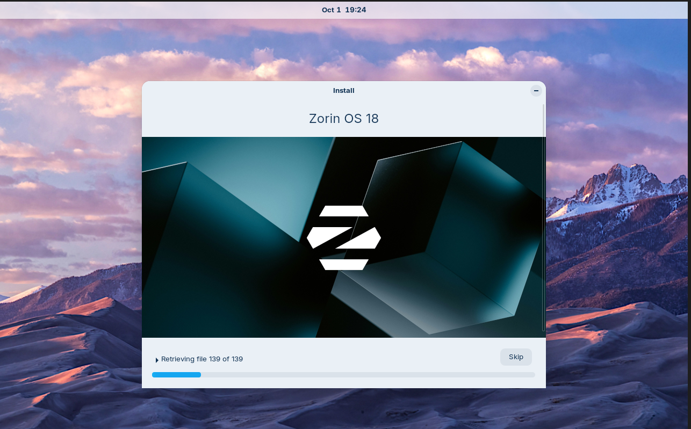

 Pantalla d’arrencada de Zorin OS 18.

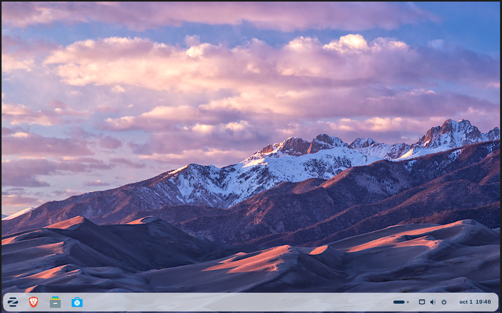

 Escriptori de Zorin OS un cop s’ha iniciat el sistema.

## Configuració de xarxa

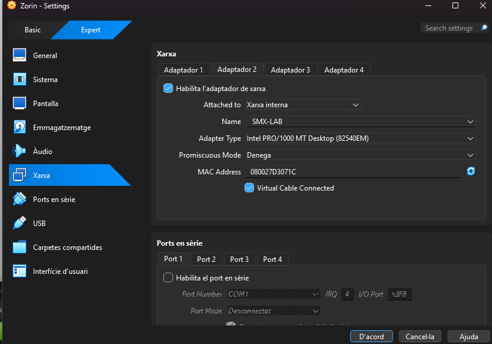

 Opcions de l’adaptador de xarxa de la màquina virtual, configurat en mode pont.

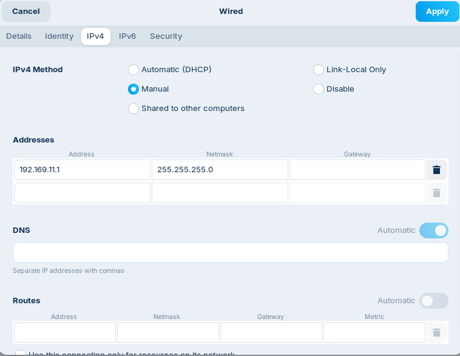

 Configuració IPv4 manual amb adreça, passarel·la i DNS.

## Comprovacions de xarxa amb terminal

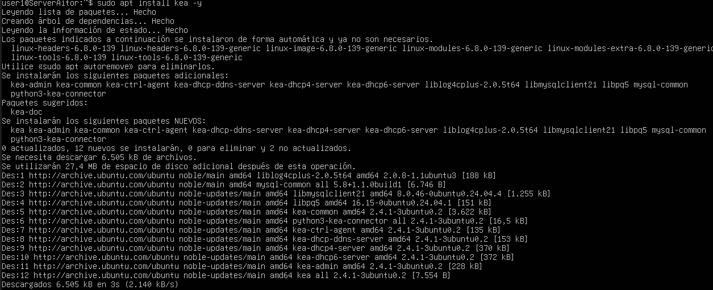

 Informació de les interfícies de xarxa mostrada al terminal.

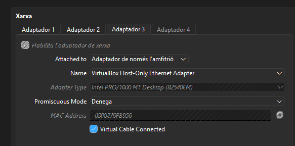

 Vista de la configuració de l’adaptador virtual.

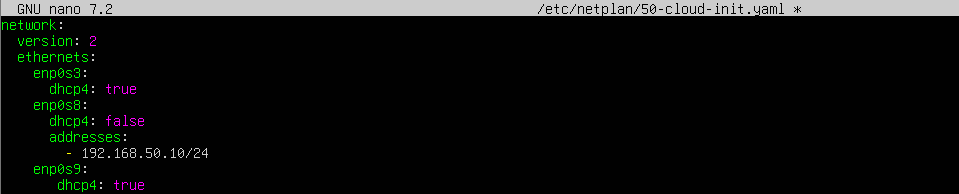

 Resultat de consultes de xarxa i adreces del sistema.

## Entorn del sistema

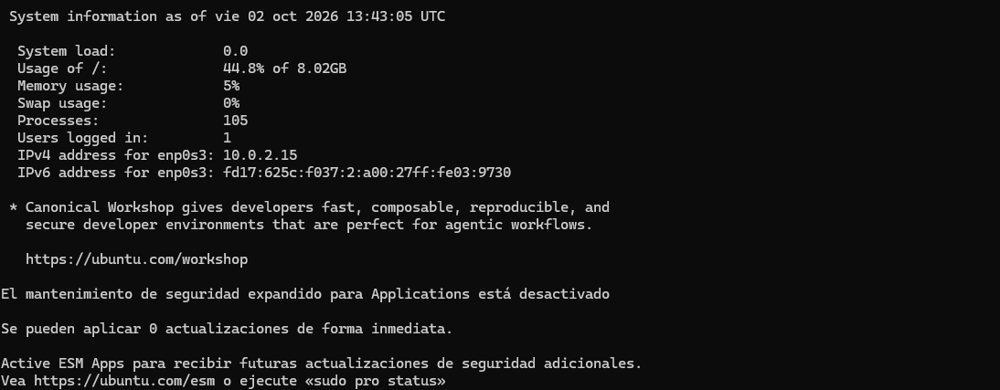

 Resum de les dades del sistema operatiu i dels recursos.

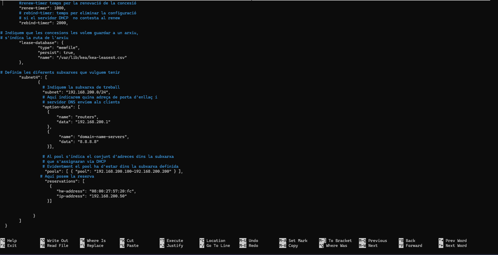

 Ordres i sortides de terminal relacionades amb la configuració.

## Wireshark

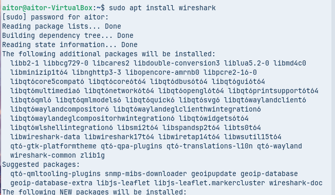

 Instal·lació de Wireshark i dels paquets que necessita.

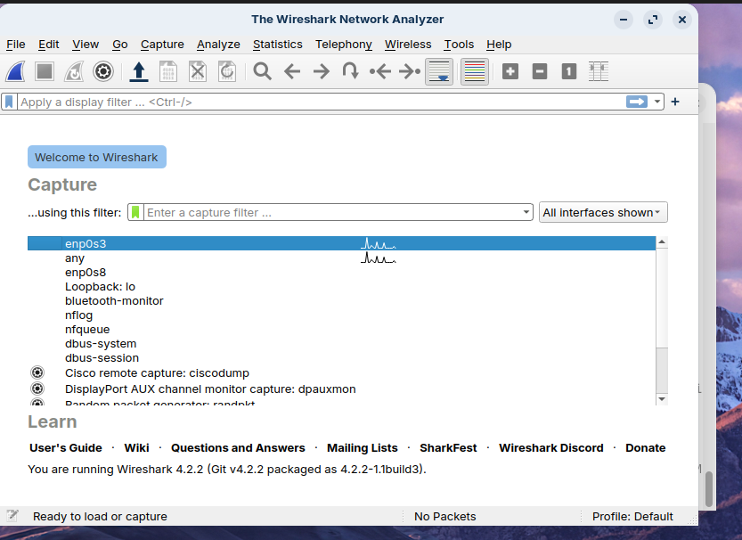

 Finestra de Wireshark abans d’iniciar una captura.

## Anàlisi del trànsit

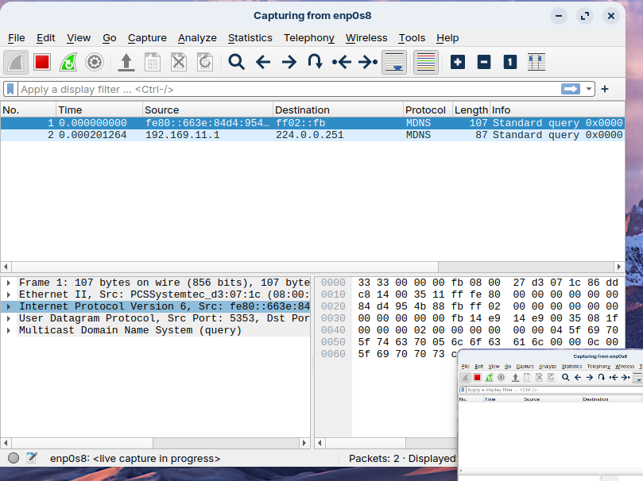

 Captura de paquets a Wireshark.

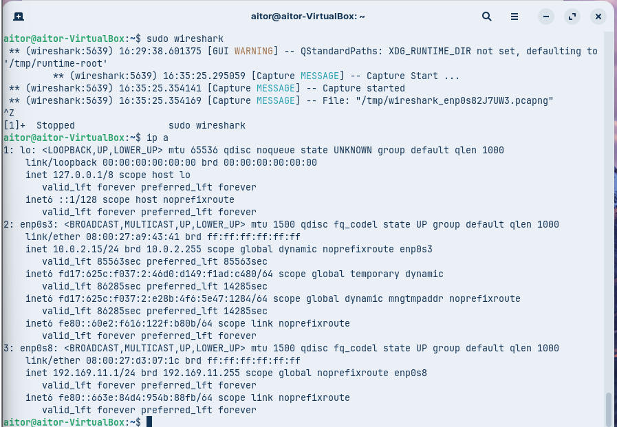

 Detall dels camps i protocols d’un paquet capturat.

## Estat de la xarxa

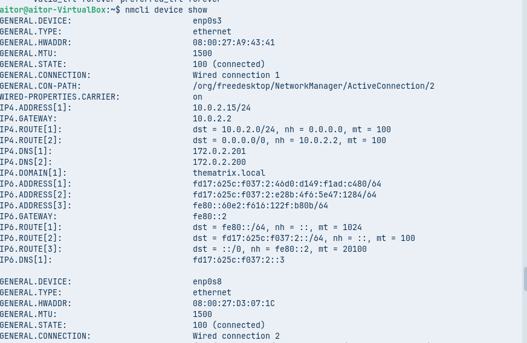

 Informació de les interfícies i del sistema consultada al terminal.

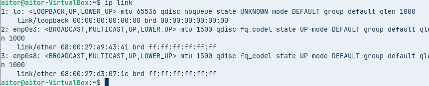

 Adreces i estat de la interfície de xarxa.

## Comprovació de DHCP

 La consulta indica que el fitxer de concessions no existeix a la ruta provada.

 Fragment de configuració DHCP en format JSON.

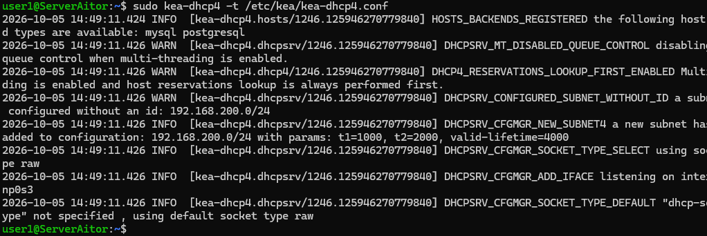

 Registres d’esdeveniments i canvis relacionats amb DHCP.

## Servei DHCP

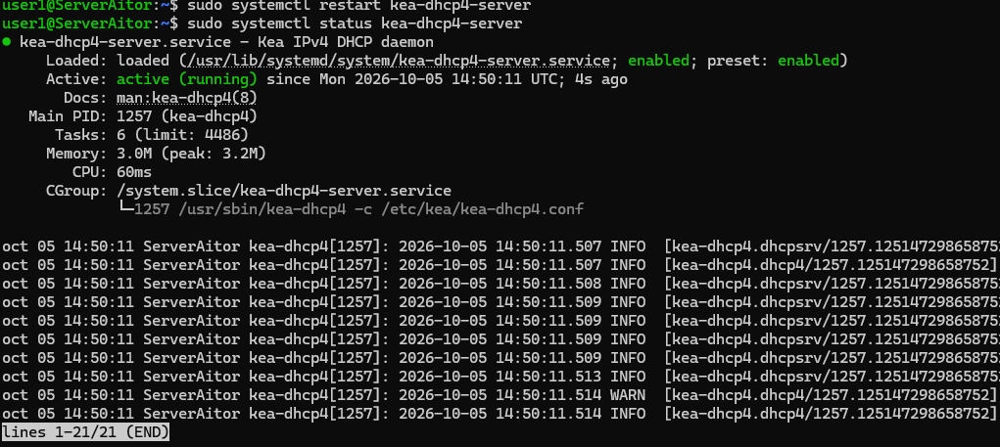

 Registres d’activitat del servei DHCP.

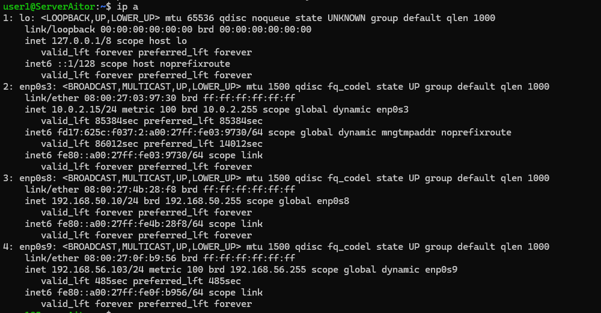
 Detall de les concessions DHCP i dels clients.

## Conclusió
En aquesta pràctica he configurat la xarxa de Zorin i he comprovat el seu funcionament amb el terminal de Zorin i Wireshark. També he tingut que cambiar el servei DHCP i els seus registres. Això m’ha ajudat a verue com funciona i com es configura les ips i tota la xarxa de un sistema, ya sigui linux com windows